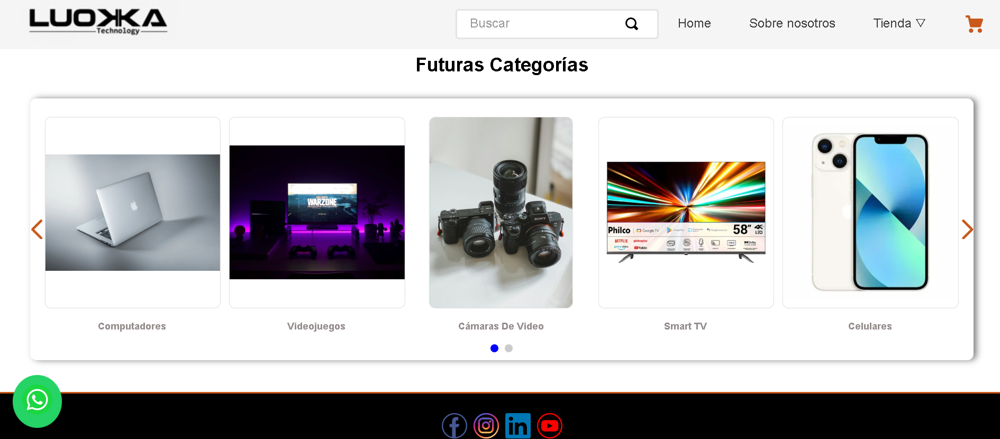
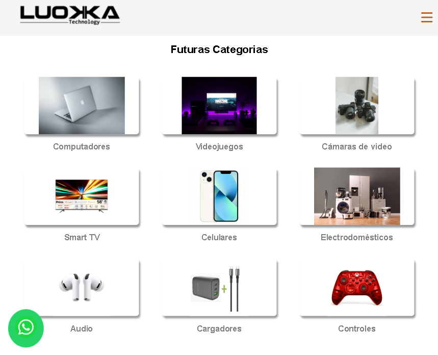

# 🏷️ Componente Bullet Group 

* [🚀 Visión General](#-visión-general)
* [🖼️ Previsualización del Componente](#-previsualización-del-componente)
* [🏗️ Instalación y Ejemplo de Uso](#-instalacion-y-ejemplo-de-uso)
    * [1. Dependencia](#1-dependencia)
    * [2. Declaración en Blocks](#2-declaración-en-blocks)
* [⚙️ Propiedades (Props)](#-propiedades-props)
    * [Estructura de cada Objeto `bullet`](#estructura-de-cada-objeto-bullet)
* [📱 Comportamiento Responsivo (Móvil)](#-comportamiento-responsivo-móvil)
* [🎨 Personalización con CSS Handles](#-personalización-con-css-handles)
* [🪪 Contribución y Licencia](#-contribución-y-licencia)


## 🚀 `Visión General`

Este componente fue creado con el template de `react-app-template` y actúa como un **Contexto de Lista (`list-context.bullet-group`)** que contiene un array de elementos (`bullets`) y los mapea en bloques individuales (`Bullet.tsx`).

Su propósito principal es crear un **slider de tipo carrusel** para presentar imágenes referentes y un enlace o ruta de navegación, ideal para agrupar categorías de manera organizada y visual.

## 🖼️ `Previsualización del Componente`


#### 💻 Vista en Escritorio




#### 📲 Vista en Móvil




## 🏗️ `Instalación y Ejemplo de Uso`

Este componente es un **Contenedor de Contexto** que debe tener bloques hijos para renderizar el contenido que mapea, generalmente un `slider-layout`.

### 1. Dependencia

Asegúrate de que la aplicación del componente esté declarada como dependencia en el `manifest.json` de tu tienda.

```json
"dependencies": {
  "{vendor}.bullets-group": "0.x"
}
```

### 2. Declaración en Blocks

El componente requiere el bloque principal (`list-context.bullet-group`) para definir los datos y bloques hijos para presentarlos (como el `slider-layout`).

```json
"list-context.bullet-group": {
  "title": "Contexto de lista de bullets",
  "props": {
    "bullets": [
      { 
        "image": "assets/img/image-1.jpg", 
        "title": "Computadores", 
        "link": { 
          "url": "/computadores" 
        } 
      },
      { 
        "image": "assets/img/image-2.jpg", 
        "title": "Controles", 
        "link": { 
          "url": "/controles" 
        } 
      }
      // ... más elementos
    ]
  },
  "children": [
    "rich-text#futuras__categorias--title",
    "slider-layout#bullets__group" 
  ]
},

"slider-layout#bullets__group": { 
  "title": "Slider de bullets group",
  "props": {
    "itemsPerPage": {
      "desktop": 5,
      "tablet": 5,
      "phone": 5
    },
    "infinite": true,
    "autoplay": { 
      "timeout": 4000 
    }
  }
}
```
## ⚙️ `Propiedades (props)`
| Propiedad | Tipo | Obligatorio | Descripción |
| :--- | :--- | :--- | :--- |
| **`bullets`** | Array de Objetos | Sí | La lista de elementos individuales que serán renderizados. Cada objeto define una imagen, un título y un enlace de navegación. |


### 🧱 `Estructura Detallada del Objeto bullet`
Cada elemento dentro del array bullets debe tener la siguiente estructura (definida en Bullet.tsx): Propiedad (Interna).

| Propiedad | Tipo | Obligatorio | Descripción |
| :--- | :--- | :--- | :---|
| **`image`** | String | sí | URL o path de la imagen del bullet. Utiliza el `image-uploader` en Site Editor, para subir la imagen si asi lo deseas.
| **`title`** | String | sí | El texto que se muestra debajo de la imagen.
| **`link`** | Objeto | sí | Objeto de enlace. Si no se provee, se usa un enlace vacío por defecto.
| **`link.url`** | String | sí | La ruta de navegación o URL a la que dirigirá el bullet.

## 📱 `Comportamiento Responsivo`
El componente (`BulletGroup.tsx`) utiliza el **vtex.device-detector** para renderizar condicionalmente:

**`Escritorio:`** Renderiza los children (el slider-layout)

**`Móvil:`** Si se detecta un dispositivo móvil, no renderiza los children. 

En su lugar, itera sobre los bullets, los coloca dentro de una sección con la clase bullet__container.

## 🎨 `Personalización con CSS Handles`
Puedes personalizar la apariencia de los elementos usando las siguientes clases (CSS Handles):

| Handle | Descripción |
| :--- | :---|
| **`bullet__container`** | Contenedor principal del grupo de bullets (usado en móvil).
| **`bullet__container--title`** | Clase para el título "Futuras Categorias" (usado en móvil).
| **`bullet__item`** | Contenedor de cada bullet individual `<div>`.
| **`bullet__item--title`** | Clase para el componente Link de VTEX `<Link>`, que envuelve la imagen y el titulo del bullet.
| **`bullet__item--image`** | Clase del elemento de imagen ``.
| **`bullet__item--link`** | Clase del elemento de texto `<p>` que contiene el titulo del bullet.


## 🪪 `Contribución y Licencia`

### 🤝 Contribución 

Si deseas contribuir con mejoras, reportar *bugs* o sugerir nuevas características:

1.  Haz un *fork* del repositorio.
2.  Crea una nueva rama (`git checkout -b feature/nueva-funcionalidad`).
3.  Realiza tus cambios y haz *commit* (`git commit -m 'feat: Añadir nueva funcionalidad'`).
4.  Sube la rama (`git push origin feature/nueva-funcionalidad`).
5.  Abre un *Pull Request*.

###  📜 Licencia

Este proyecto está bajo la **Licencia MIT**.

> **[](https://opensource.org/licenses/MIT)**

> **[](https://github.com/vtex-apps/whatsapp-button/blob/main/LICENSE)**